# STL-SVPIO — Reproduction Notes

This repository documents an attempt to reproduce the results of the `stl-svpio` paper.

---
## Table I — single-agent reach-avoid

**Finding: the committed pipeline does not reproduce its own reference CSV.**

A clean checkout was installed in an isolated environment with the locked `stljax==1.1.3` and run on CPU. Result versus the committed reference (`results/reference/table1_reach_avoid_summary.csv`), robustness values:

| method | reference | CPU | GPU |
|---|---|---|---|
| stl_svpio | **+0.108** | −2.471 | −2.471 |
| mppi | **+0.005** | −0.797210 | −0.797210 |
| dpi | **+0.179** | crashes (see below) | −3.500 |

Two points make this a firm conclusion rather than an environment artifact:

1. **MPPI and STL-SVPIO is bit-identical** between the CPU (−0.797210) and GPU run (−0.797210). MPPI has no gradient path, so it is deterministic given the seed, and the local environment reproduces the committed code exactly — yet it does not match the reference. STL-SVPIO is also bit-identical across devices.
2. **DPI, SVMPC, and STLCG-GD cannot run as committed.** Their configs set `stl_temperature: null` while inheriting `stl_approx_method: logsumexp`, and `stljax` raises `AssertionError: need a temperature value` for that combination. A clean checkout crashes on these methods.

### Feasibility strips (reach-avoid, STL-SVPIO)

Feasibility of the single-agent reach-avoid task as `svgd_iters` is swept from 20 to 200, one strip per fixed `stl_temperature`. Feasibility is judged by the exact STL Boolean (`specification.eval`). Black = feasible, white = infeasible. Temperatures with no feasible iteration are omitted. A surprising result here is that though we see feasibility occur early in the run, it eventually looses the feasibility before coming back, this fluctuation is present across all temperature ranges.

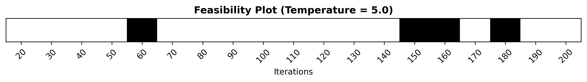

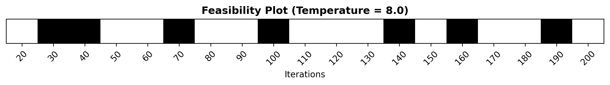

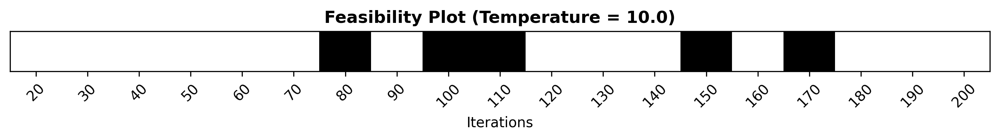

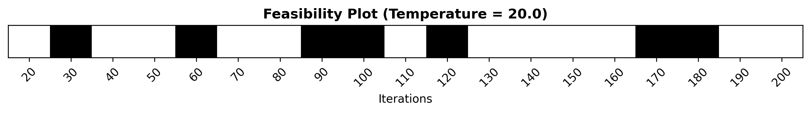

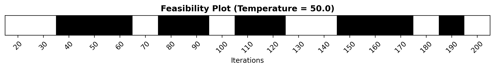

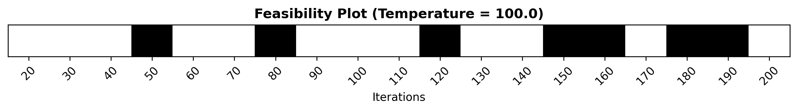

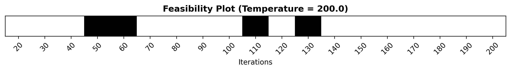

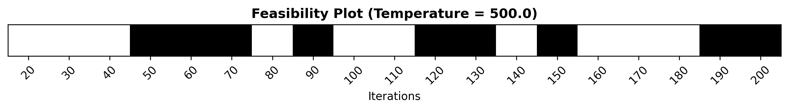

---

## Sweep Outcome

After setting the `stl_approx_method: "true"`, and running the sweep, from where we choose the smallest iteration where feasibility is observed (`stl_temprature: 8`, `iterations: 30`), running the experiment again yields the following table:

| Method | Robustness | Satisifed | Runtime (ms) |
|---|---|---|---|
| stl_svpio | -0.065891 | true | 1193.984 |
| mppi | -0.924563 | false | 669.433 |
| svmpc | -1.702659 | false | 1455.776 |
| dpi | -3.500000 | false | 768.426 |
| stlcg_gradient_descent | -3.498310 | false | 412.975 |

Note that the above robustness values were reported using the smoothed `logsumexp` robustness, not the true robustness. 

## Update 1 - TPE based hyper-parameter tuning for STL-SVPIO

I used Tree-Structured Parzen Estimator (TPE) to run a Bayesian tuning loop over three hyper-parameters (STL temperature, SVGD step size and SVGD final step size) and obtained results better than the ones reported in the paper in the same 20 iterations, see [file](./docs/utils/sweep_stl_svpio_table1.py) for details on the search space and best configuration. 

| Method | True Robustness | Smoothed Robustness | Satisifed | Runtime (ms) | Robustness in the paper
|---|---|---|---|---|---|
| stl_svpio | 0.265759 | 0.202061 | true | 1284.050 | 0.108 |

---

## Figure 3 — point-mass benchmark (STL-SVPIO, before vs after sweep-tuning)

The committed Figure 3 presets do not reproduce the paper's near-total satisfaction for STL-SVPIO. Re-running STL-SVPIO with the sweep-tuned configuration (`stl_approx_method: "true"`, larger step / higher temperature from the per-task sweep) improves some tasks substantially but does **not** recover the paper's result uniformly. All values are satisfaction rate and mean STL robustness over 100 seeds; the paper reference is the target.

| task | satisfaction (before) | satisfaction (after) | paper | mean ρ (before) | mean ρ (after) |
|---|---|---|---|---|---|
| multiagent_corridor_6_agents | 0.39 | **0.77** | 1.00 | +0.002 | **+0.064** |
| multiagent_sync_goals | 1.00 | 1.00 | 1.00 | +0.335 | +0.409 |
| multiagent_button | 0.47 | 0.38 | 1.00 | −0.171 | −0.064 |
| single_visit_goals_long_horizon | 0.01 | 0.02 | 0.97 | −1.126 | −1.261 |
| **mean** | **0.47** | **0.54** | 0.99 | | |

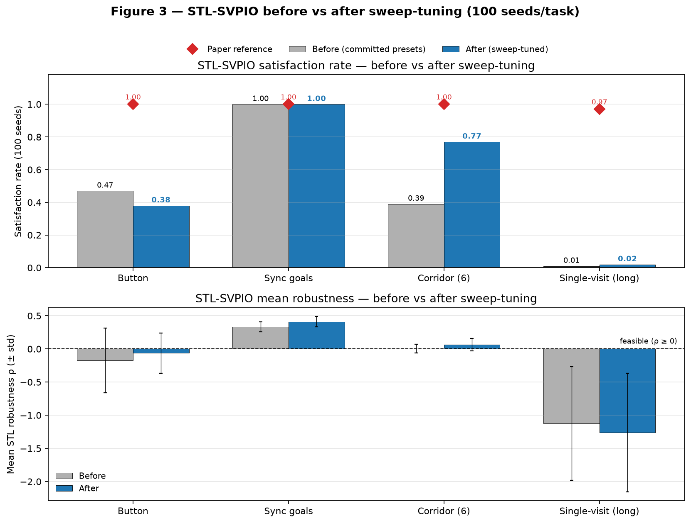

**What the data shows (precisely):**

- **Corridor improved markedly:** 0.39 → 0.77, with mean robustness moving from the boundary (+0.002) to clearly positive (+0.064). This is the main gain from tuning.
- **Sync goals stayed solved:** 1.00 → 1.00; mean robustness rose (+0.335 → +0.409). It was already at the ceiling, so tuning could not improve the rate.
- **Button did not improve:** satisfaction fell 0.47 → 0.38, even though its mean robustness rose (−0.171 → −0.064). The per-seed distribution tightened (std 0.488 → 0.305) around a mean that is still below zero, so fewer seeds cross the feasibility boundary despite the better average. Higher mean, lower satisfaction.
- **Single-visit (long horizon) remains unsolved:** 0.01 → 0.02, mean robustness essentially unchanged and still strongly negative (−1.126 → −1.261).

> The "after" run covers STL-SVPIO only; the baseline methods were not re-run.

The following graph was constructed from the first run of the codebase without tuning and actually compares between baselines. The graph clearly shows that though the quantitative results of the paper does not hold from the given configuration, the qualitative result that STL-SVPIO is superior to other methods still hold.  

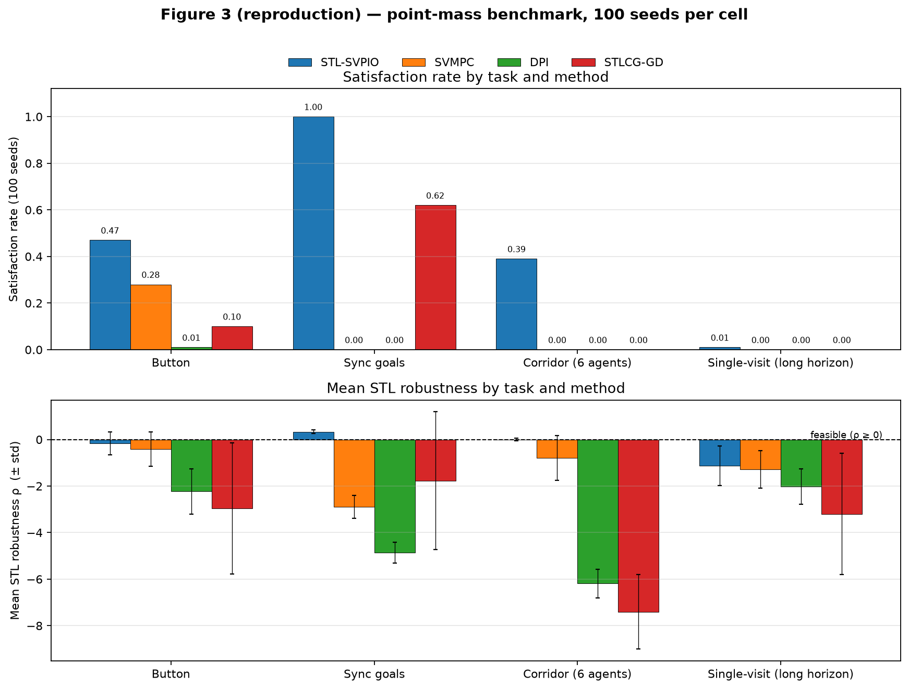

---

## Update — Figure 3 reproduces once the scene seed is pinned

The Figure 3 caption states that all non-MILP algorithms were evaluated across **100 different random sampling seeds**. The committed code does not do this. In `configs/paper/*_pointmass.yaml` the `scene_seed` key is declared as a *sibling* of `args` rather than inside it, and `_load_presets` in `scripts/reproduce_figure3.py` reads only `item["args"]`. So each of the 100 trials generates a completely different arena, different obstacle layout, zone placement and start state.

### Why I assumed a fixed scene was intended

1. **The MILP baseline already uses a fixed scene.** `configs/paper/milp_pytelo_pointmass.yaml` declares `seed: 0` *inside* the task dict, where it is read, and MILP is solved exactly once per task. Under the unpatched behaviour MILP is therefore evaluated on a single arena while the sampling methods are averaged over 100 different ones.
2. **No arena other than seed 0 appeared to be feasible.** Across extensive TPE tuning on the long-horizon task, seed 0 was the only trial that ever produced a feasible trajectory; no hyper-parameter configuration recovered positive robustness on any other seed.
3. **`scene_seed` exists in every preset but is dead code.** All four method configs carry `scene_seed: 0` for the long-horizon task and `scene_seed: 32` for the button task. A per-task hand-picked value is not something you write for a protocol meant to marginalise over arenas, and `PointMassTrialResult` records `seed` and `sampling_seed` as *separate* fields — the two axes were clearly intended to be independent.

### Result

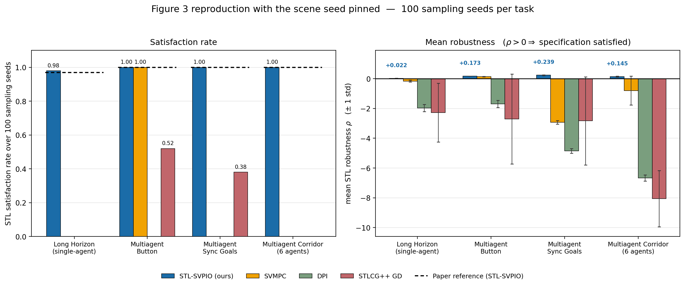

| task | satisfaction (unpatched) | satisfaction (scene pinned) | paper | mean rho (scene pinned) |
|---|---|---|---|---|
| single_visit_goals_long_horizon | 0.01 | **0.98** | 0.97 | +0.0220 |
| multiagent_button | 0.47 | **1.00** | 1.00 | +0.1727 |
| multiagent_sync_goals | 1.00 | **1.00** | 1.00 | +0.2393 |
| multiagent_corridor_6_agents | 0.39 | **1.00** | 1.00 | +0.1454 |
| **mean** | **0.47** | **1.00** | 0.99 | |

**Caveat.** `scene_seed: 0` is the value committed in the YAML, but since the key was never read, nothing in the repository ever exercised it, and I cannot confirm it is the arena the authors actually plotted. The agreement with the reported numbers is strong evidence that it is. MILP is not included in the figure above; it times out on the long-horizon task, as reported in the paper.

---

## Nonlinear MJX tasks — panda reach & halfcheetah backflip

Unlike Table I / Figure 3, these are single deterministic long-horizon GPU runs (no seed distribution), so each is compared as one robustness scalar plus the satisfied boolean against the committed reference (`results/reference/*_results.json`). Runtime is hardware-dependent and shown for information only.

| task | reference ρ | run ρ | ref satisfied | run satisfied | outcome |
|---|---|---|---|---|---|
| panda_goal_reach | +0.0289 | +0.0310 | true | true | **reproduces** |
| halfcheetah_backflip | +0.1676 | **−2.4824** | true | **false** | **does not reproduce** |

Runtimes (informational, hardware-dependent): panda 657 s ref / 207 s run; cheetah 593 s ref / 386 s run. The panda run matched the reference robustness almost exactly while running 3.3× faster, which indicates the speedup is hardware/JIT rather than a truncated run — so the cheetah failure is unlikely to be an early-stop artifact.

### panda_goal_reach — reproduces


The arm bends over and drives the gripper down onto the goal markers. Robustness is +0.0310 versus the reference +0.0289 — a match within 0.002, both satisfied. Both values sit barely above zero, so the reference itself is a marginally-satisfying plan; the rollout looks tentative because the specification is met by a hair on both sides.

### halfcheetah_backflip — does not reproduce

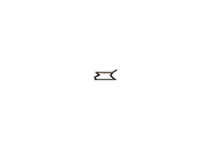

The cheetah rears up off its back but collapses into a heap without carrying the torso through the rotation. Robustness is −2.4824 versus the reference +0.1676 — a large-margin violation, not a boundary miss, and `stl_satisfied` is false. The rollout confirms the number: the backflip is not performed.

**Conclusion.** The nonlinear tasks show the same partial, task-dependent pattern as the rest of the study: `panda_goal_reach` reproduces, while `halfcheetah_backflip` does not under the committed configuration. I did try (albeit a far smaller pool) a few hyperparameters (such as itereations, step size, and samples) but I did not see any improvement. 

**Note** If trying to replicate the experiment on a single GPU workstation, note that the nonlinear task will fail since it has multiple GPU hard-coded, replace the GPU index 1 with 0 and it should work fine.  

## Update — halfcheetah backflip reproduces once the MJX backend is used

**Root cause: the committed cheetah run never used MJX.** The paper config (`configs/paper/nonlinear.yaml`) specifies `backend: mjx`, but `stl-svpio nonlinear --run` launches the runner with **no arguments** — the yaml is only read to print reference numbers. The runner then falls back to its argparse default, `--backend generalized` (Brax's own physics engine, not MuJoCo MJX).

**Why the panda was unaffected.** `run_panda_goal_reach.py` differs in two ways: its default backend is already `mjx`, and it contains a guard that force-overrides `--mj-iterations` to 1 for reverse-mode differentiation (MJX's constraint solver uses `lax.while_loop` when `iterations > 1`, which `jax.grad` cannot differentiate). The cheetah runner is missing this guard, so fixing the backend alone crashes; both flags must be set by hand:

```bash
uv run python -m stl_svpio._paper_runners.run_halfcheetah_backflip --backend mjx --mj-iterations 1
```

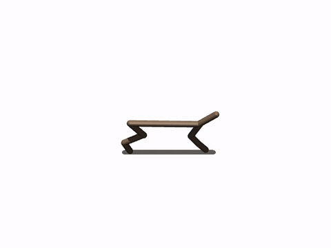

Note that though with the MJX backend the planner is able to find a control sequence that perfectly satisfies the control sequence it still looks a little weird, specifically, the cheetah never lands, it makes a giant leap and turns mid-air which allows it to satisfy the spec. 
